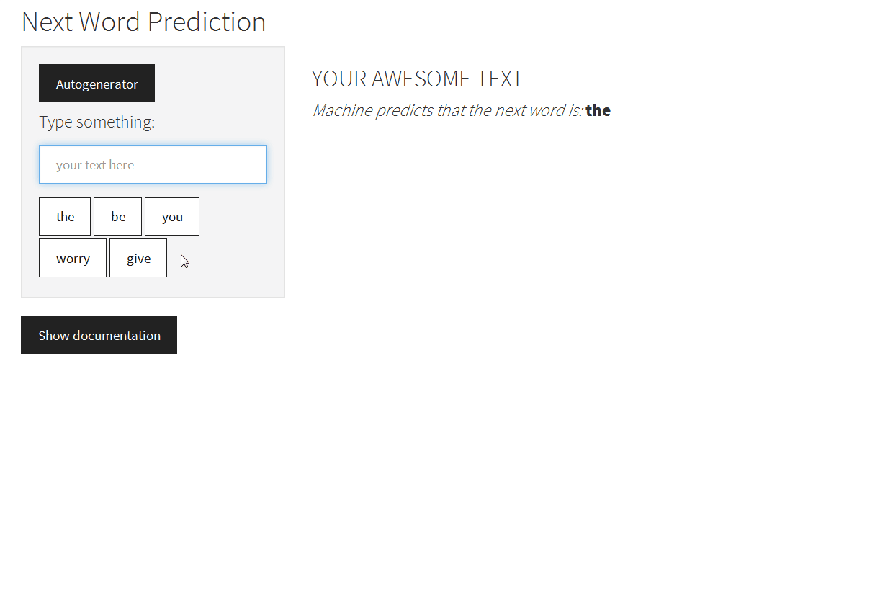
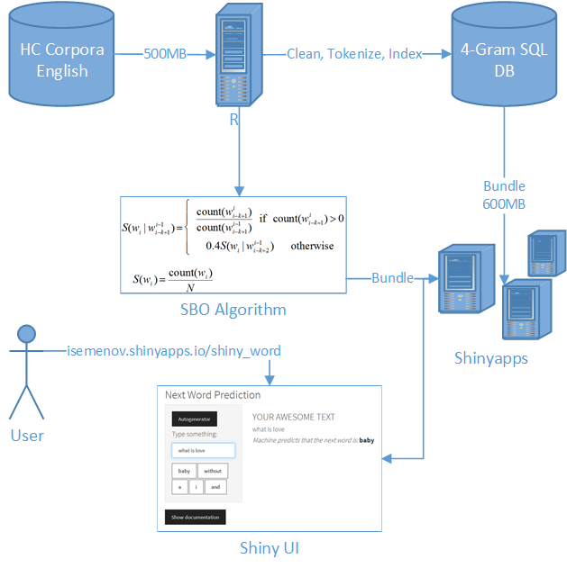

Next Word Prediction (NWP) Tool
========================================================
author: Ilia Semenov 
date: April 2016
transition: rotate
font-import: http://fonts.googleapis.com/css?family=Muli
font-family: 'Muli'
width: 1000
height: 700

<small> 
John Hopkins University
Data Science Specialization
Coursera
</small>

Overview
========================================================
incremental: true

**Next Word Prediction (NWP) Tool by Ilia Semenov** is:
 
- Web-based app that predicts the next word of your input
- Awesome design of UI
- Strong beck-end based on latest NLP algorithms
- Project supported by John Hopkins University, Swiftkey and Coursera
- Lots of fun - [try it yourself!](https://isemenov.shinyapps.io/shiny_word/)

Showcase
========================================================

Data and Algorithm
========================================================

## Data

- [HC Corpora](http://www.corpora.heliohost.org/aboutcorpus.html): English
- 550MB of text, 3M Lines, 70M words
- N-Grams up to 4th order generated: 7GB of data
- N-Grams are truncated: 600MB of data
- N-Gram tables are stored in SQLite DB with indexes for search performance

***

## Algorithm

- [Stupid Backoff](http://www.aclweb.org/anthology/D07-1090.pdf) (SBO, Brants et al. 2007): **16%** accuracy, **0.13** seconds execution time
- Get probability from highest N-Gram and back off to lower N-gram if no match
- Implemented in R with RSQLite for live DB querying

Schema and Roadmap
========================================================

## Schema

***
## Roadmap

- Introduce sentence start/end recognition
- Increase data size
- Predict partial words
- Introduce interpolation in case no more data available

